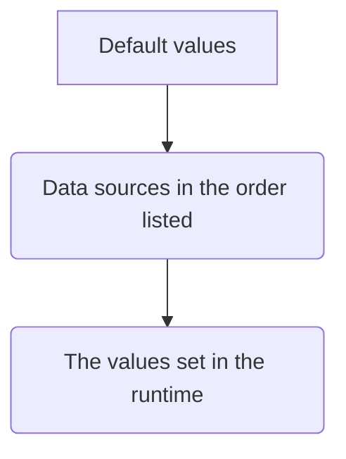

<details>
  <summary>ⓘ</summary>

[](https://pepy.tech/project/skelet)
[](https://pepy.tech/project/skelet)
[](https://coveralls.io/github/pomponchik/skelet?branch=main)
[](https://github.com/boyter/scc/)
[](https://hitsofcode.com/github/pomponchik/skelet/view?branch=main)
[](https://github.com/pomponchik/skelet/actions/workflows/tests_and_coverage.yml)
[](https://pypi.python.org/pypi/skelet)
[](https://badge.fury.io/py/skelet)
[](http://mypy-lang.org/)
[](https://github.com/astral-sh/ruff)
[](https://deepwiki.com/pomponchik/skelet)

</details>


Collect all the settings of your project in one place. Ensure type safety, thread safety and information security, and automatically validate all types and values. Use simple and elegant "pythonic" syntax. Automatically load values from config files and environment variables.

## Table of contents

- [**Quick start**](#quick-start)
- [**Default values**](#default-values)
- [**Documenting fields**](#documenting-fields)
- [**Secret fields**](#secret-fields)
- [**Type checking**](#type-checking)
- [**Validation of values**](#validation-of-values)
- [**Conflicts between fields**](#conflicts-between-fields)
- [**Sources**](#sources)
  - [**Environment variables**](#environment-variables)
  - [**TOML files and pyproject.toml**](#toml-files-and-pyprojecttoml)
  - [**JSON files**](#json-files)
  - [**YAML files**](#yaml-files)
  - [**Collecting sources**](#collecting-sources)
- [**Converting values**](#converting-values)
- [**Thread safety**](#thread-safety)
- [**Callbacks for changes**](#callbacks-for-changes)
- [**Read only fields**](#read-only-fields)


## Quick start

Install it:

```bash
pip install skelet
```

You can also quickly try out this and other packages without having to install using [instld](https://github.com/pomponchik/instld).

Now let's create our first storage class:

```python
from skelet import Storage, Field, NonNegativeInt

class ManDescription(Storage):
    name: str = Field('*')
    age: NonNegativeInt = Field(0, validation={'You must be 18 or older to feel important': lambda x: x >= 18}, validate_default=False)
```

You can immediately notice that this is very similar to [dataclasses](https://docs.python.org/3/library/dataclasses.html) or [models from Pydantic](https://docs.pydantic.dev/latest/api/base_model/). Yes, it's very similar, but it's better sharpened specifically for use for storing settings.

So, let's create an object of our class and look at it:

```python
description = ManDescription(name='Evgeniy', age=32)
print(description)
#> ManDescription(name='Evgeniy', age=32)
```

The object that we created is not just a storage for several fields. It can also [validate values](#validation-of-values) and [verify typing](#type-checking). Let's try to slip to it something wrong:

```python
description.age = -5
#> TypeError: The value "-5" (int) of the "age" field does not match the type NonNegativeInt.
description.age = 5
#> ValueError: You must be 18 or older to feel important
description.name = 3.14
#> TypeError: The value "3.14" (float) of the "name" field does not match the type str.
```

That's not bad! But you will become a real master of storing settings when you read the entire text below.


## Default values

You must specify a default value for each field. It will be used until you somehow redefine it, or if no other value is found in the [data sources](#sources).

There are 2 types of default values:

- **Ordinary**.
- **Lazy**, or delayed.

You can already see examples of ordinary default values above. Here's another one:

```python
class UnremarkableSettingsStorage(Storage):
    ordinary_field: str = Field('I am the ordinary default value!')

print(UnremarkableSettingsStorage())
#> UnremarkableSettingsStorage(ordinary_field='I am the ordinary default value!')
```

But you can also pass a function that returns the default value: it will be called every time a new object is created. This is called a lazy default value:

```python
class UnremarkableSettingsStorage(Storage):
    ordinary_field: str = Field(default_factory=lambda: 'I am the lazy default value!')

print(UnremarkableSettingsStorage())
#> UnremarkableSettingsStorage(ordinary_field='I am the lazy default value!')
```

This option is preferable if you want to use a mutable object, such as a `list` or `dict`, as the default value. A new object will be created for this field every time a new storage object is created, so your data will not be "shuffled".


## Documenting fields

Sometimes, in order not to forget what a particular field in the repository means, you may be tempted to accompany it with a comment:

```python
class TheSecretFormula(Storage):
    the_secret_ingredient: str = Field('*')  # frogs' paws or something else nasty
    ...
```

Don't do that! It is better to use the `doc` parameter in the field:

```python
class TheSecretFormula(Storage):
    the_secret_ingredient: str = Field('*', doc="frogs' paws or something else nasty")
    ...
```

Not only does this make the code self-documenting, you will also receive "free" reminders of the contents of this field in all exceptions that the library will raise:

```python
formula = TheSecretFormula(the_secret_ingredient=13)
#> TypeError: The value "13" (int) of the "the_secret_ingredient" field (frogs' paws or something else nasty) does not match the type str.
```


## Secret fields

Sometimes it is better not to see the contents of some fields to strangers. If such people can read, for example, the logs of your program, you may have problems. Secret fields have been invented for such cases:

```python
class TopStateSecrets(Storage):
    who_killed_kennedy: str = Field('aliens', validation=lambda x: x != 'russians', secret=True)
    red_buttons_password: str = Field('1234', secret=True)

print(TopStateSecrets())
#> TopStateSecret(who_killed_kennedy=***, red_buttons_password=***)
```
If you mark a field with the `secret` flag, as in this example, its contents will be hidden not only when printing, but also under any exceptions that the library will raise:

```python
secrets = TopStateSecrets()

secrets.who_killed_kennedy = 'russians'
#> ValueError: The value *** (str) of the "who_killed_kennedy" field does not match the validation.
```

In all other respects, "secret" fields behave the same as regular ones, you can read values and write new ones.


## Type checking

You can specify a type hint for each field of your class. This is not necessary, but if you do, all values of this field will be automatically checked against the specified type, and if they do not match, a `TypeError` exception will be raised:

```python
class HumanMeasurements(Storage):
    number_of_legs: int = Field(2)
    number_of_hands: int = Field(2)

measurements = HumanMeasurements()

measurements.number_of_legs = 'two'
#> TypeError: The value "two" (str) of the "number_of_legs" field does not match the type int.
```

The Python typing system has its limitations. According to the author, it is [too overcomplicated](https://www.reddit.com/r/Python/comments/10zdidm/why_type_hinting_sucks/), there are too many different concepts in it, and checking some of the type constraints in runtime is almost impossible. Therefore, the library supports only a subset of types from the typing module.

*How does it work?* It is based on a simple type matching check via `isinstance`. A minimum number of additional annotations is also supported:

- `Any` - means the same thing as the absence of an annotation.
- `Union` (in the old style or in the new one, using the `|` operator) - means logical OR between types.
- `Optional` (again, both in the old style and in the new one - via `|`) - means that a value of the specified type is expected, or `None`.
- `Lists`, `dicts`, and `tuples` can be specified with the types they contain. By default, the contents of these containers are not checked, but this is done in relation to external [sources](#sources).

The author deliberately does not try to implement full type checking in runtime. If you need more powerful verification, it's better to rely on static tools like `mypy`.

The library also supports 2 additional types that allow you to narrow down the behavior of the basic int type:

- `NaturalNumber` — as the name implies, only objects of type `int` greater than zero will be checked for this type.
- `NonNegativeInt` — the same as `NaturalNumber`, but `0` is also a valid value.

Please note that these types of constraints are checked only in runtime.


## Validation of values

In addition to type checking, you can specify arbitrary conditions by which field values will be checked.

The simplest way to validate a specific field is to pass a lambda function that returns a `bool` value as the `validation` argument for the field:

```python
class ScaryNumbers(Storage):
    unlucky_number: int = Field(13, validation=lambda x: x in [13, 17, 4, 9, 40], doc='a number that is considered unlucky by a particular people')
    number_of_the_beast: int = Field(666, validation=lambda x: x in [616, 666], doc='different translations of the Bible give different numbers for the beast')

numbers = ScaryNumbers()
```

This function should return `True` if the value is valid, and `False` if it is not. If you try to assign an invalid value to the field, an exception will be raised:


```python
numbers.unlucky_number = 7
#> ValueError: The value "7" (int) of the "unlucky_number" field (a number that is considered unlucky by a particular people) does not match the validation.
numbers.number_of_the_beast = 555
#> ValueError: The value "555" (int) of the "number_of_the_beast" field (different translations of the Bible give different numbers for the beast) does not match the validation.
```

You can also pass a dictionary as a `validation` parameter, where the keys are messages that will accompany the raised exceptions, and the values are the same functions that return boolean values:

```python
class Numbers(Storage):
    zero: int = Field(0, validation={'Zero is definitely greater than your value.': lambda x: x > -1, 'Zero is definitely less than your value.': lambda x: x < 1})
    ...

numbers = Numbers()

numbers.zero = 1
#> ValueError: Zero is definitely less than your value.
numbers.zero = -1
#> ValueError: Zero is definitely greater than your value.
```

> ⓘ If the value does not pass validation, not only will an exception be thrown, but the value will also not be saved for that field. This is similar to how [constraints](https://en.wikipedia.org/wiki/Check_constraint) work in databases.

> ⓘ Validation occurs after [type checking](#type-checking), so you can be sure that types match when your validation function is called.

All values are validated, including default values. However, sometimes you may need to disable validation only for default values, for example, if you use some identifiers for the absence of real values ([`None`](https://docs.python.org/3/library/constants.html#None), [`MISSING`](https://docs.python.org/3/library/dataclasses.html#dataclasses.MISSING), [`NaN`](https://docs.python.org/3/library/math.html#math.isnan), an empty string, or something similar). In this case, pass `True` as the `validate_default` argument:

```python
class PatientsCard(Storage):
    had_rubella: bool | None = Field(
        None,
        validation: lambda x: isinstance(x, bool),
        validate_default=False,  # The default value will not be checked.
        doc='we may not know if a person has had rubella, but if we do, then either yes or no',
    )
    ...
```


## Conflicts between fields

Sometimes, individual field values are [acceptable](#validation-of-values), but certain combinations of them are impossible. For such cases, there is a separate type of value check — conflict checking. This validation is a little more complicated than for individual values. To enable it, you need to pass a dictionary as parameter `conflicts`, whose keys are the names of other class fields, and whose values are functions that return `bool`, answering the question «is there a conflict with the value of this field?»:

```python
class Dossier(Storage):
    name: str | None = Field(None)
    is_jew: bool | None = Field(None, doc='jews do not eat pork')
    eats_pork: bool | None = Field(
        None,
        conflicts={'is_jew': lambda old, new, other_old, other_new: new is True and (other_old is True or other_new is True)},
    )
    ...
```

When we attempt to redefine the value of a field that has conflict conditions defined with another field, these conditions will be checked and, if a conflict is confirmed, the operation will be stopped by throwing an exception:

```python
dossier = Dossier(name='John')

dossier.is_jew = True
dossier.eats_pork = True
#> ValueError: The new "True" (bool) value of the "eats_pork" field conflicts with the "True" (bool) value of the "is_jew" field (jews do not eat pork).
```

> ⓘ Conflict checking only happens after [type](#type-checking) and individual [value checking](#validation-of-values). This means that only values that are guaranteed to be valid in terms of individuality will be passed to your conflict checking function.

> ⓘ More details on this will be provided in the section on [thread safety](#thread-safety), but here it is useful to know that mutexes for fields with specified conflict conditions are combined. This means that checking fields for conflicts is thread-safe.

The function that checks for a conflict with the value of another field takes 4 positional arguments:

- The old value of the current field.
- New value of the current field.
- The old value of the field with which a conflict is possible.
- The new value of the field with which a conflict is possible.

But why can there be two values for another field? The fact is that, by default, conflict conditions are checked when values are changed not only for the field for which they are set, but also for potentially conflicting fields:

```python
dossier.eats_pork = True
dossier.is_jew = True
#> ValueError: The new "True" (bool) value of the "is_jew" field (jews do not eat pork) conflicts with the "True" (bool) value of the "eats_pork" field.
```

Reverse checks can be disabled by passing `False` as the `reverse_conflicts` parameter:

```python
    ...
    eats_pork: bool | None = Field(
        None,
        conflicts={'is_jew': lambda old, new, other_old, other_new: new is True and (other_old is True or other_new is True)},
        reverse_conflicts=False,  # Conflicts will now only be checked when the values of this field change, but not when other fields change.
    )
    ...
```

However, I do not recommend disabling reverse checks - they ensure that the contents of the fields are consistent with each other.


## Sources

So far, we have discussed that fields can have default values, as well as values obtained during the program operation. However, there is a third type of value: values loaded from data sources. The library supports several data sources:

- Configuration files in various formats ([`TOML`](#toml-files-and-pyprojecttoml), [`YAML`](https://en.wikipedia.org/wiki/YAML), and [`JSON`](https://en.wikipedia.org/wiki/JSON)).
- [Environment variables](#environment-variables).
- Support for new sources, such as CLI parameters, will be available soon.

The current value of each class field is determined by the following order:



That is, values obtained from sources have higher priority than default values, but can be overwritten (unless you [prohibit it](#read-only-fields)) by other values at runtime.

There are two ways to specify a list of sources:

- For the **whole class**.
- For a **specific field**.

To specify a list of sources for the entire class, pass it to the class constructor:

```python
from skelet import TOMLSource

class MyClass(Storage, sources=[TOMLSource('pyproject.toml', table='tool.my_tool_name')]):
    ...
```

Also use the `sources` parameter to specify a list of sources for a specific field:

```python
class MyClass(Storage):
    some_field = Field('some_value', sources=[TOMLSource('pyproject.toml', table='tool.my_tool_name')])
```

You can also combine these two options by specifying one list of sources for the class as a whole and another list for a specific field. Keep in mind that in this case, the list of sources for this field will be completely rewritten. If you want this field to use both its own set of sources and the class's list of sources, specify an ellipsis at the end of the list for the field:

```python
class MyClass(Storage, sources=[TOMLSource('pyproject.toml', table='tool.my_tool_name')]):
    some_field = Field('some_value', sources=[TOMLSource('config_for_this_field.toml'), ...])
```

All values from sources are loaded when the config object is created. This means that (theoretically) during program execution, you can, for example, change a configuration file, then create a new storage object, and its contents will be different. The old object will not automatically know that the config file has been changed. Avoid this kind of behavior in your programs if you don't want to run into problems that will be very difficult to detect.

Each data source is a dictionary-like object from which the values of a specific field are retrieved by the key in the form of the field name. If no value is found in any of the sources, only then will the default value be used. The order in which the contents of the sources are checked corresponds to the order in which the sources themselves are listed, with sources for a field having higher priority than sources for the class as a whole.

For any field, you can change the key used to search for its value in the sources using the `alias` parameter:

```python
class MyClass(Storage, sources=[TOMLSource('pyproject.toml', table='tool.my_tool_name')]):
    some_field = Field(alias='another_key')
```

Values obtained from sources are validated in the same way as all others. However, [type checking](#type-checking) for collections is stricter here: the contents of lists, dictionaries, and tuples are checked in their entirety.

Read more about the available types of sources below.


## Environment variables

For many developers, [environment variables](https://en.wikipedia.org/wiki/Environment_variable) are the first method that comes to mind for [obtaining application settings](#sources) from outside sources. To connect environment variables to your class or class field, use the `EnvSource` class:

```python
class MyClass(Storage, sources=[EnvSource()]):
    some_field = Field('some_value')
```

By default, environment variables are searched for by key in the form of an attribute name, but the case is ignored. If you want to make the search case-sensitive, pass `True` as the `case_sensitive` parameter:

```python
EnvSource(case_sensitive=True)
```

> ⚠️ On `Windows`, environment variables are case-insensitive, so this setting will not work.

Sometimes you may also want to “personalize” environment variables, i.e., bind them to your application or library using a prefix. For example, you may want the value for the `field_name` attribute to be searched for using the `prefix_` key. In this case, set the appropriate prefix:

```python
EnvSource(prefix='prefix_')  # So, for attribute "field_name", the search will be performed by key "prefix_field_name".
```
Similar to the `prefix`, you can also specify a `postfix` — a piece of the key that will be added at the end:

```python
EnvSource(postfix='_postfix')  # For attribute "field_name", the search will be performed by key "field_name_postfix".
```

> ⓘ It is important to understand that `EnvSource` objects cache all environment variable values. A complete cache of all variables is created when the key is searched for the first time. Currently, there is no option to clear the cache; the object can only be replaced entirely.


## TOML files and pyproject.toml

The [`TOML`](https://toml.io/en/) format is currently the most preferred file format for storing application settings for Python.The TOML format is currently the most preferred file format for storing application settings for Python. It is very easy to interpret in programming languages in dictionary-like structures, and it is also minimalistic and easy to read.

To read the configuration from a specific file, create a `TOMLSource` object passing the file name or a [Path-like object](https://docs.python.org/3/library/pathlib.html#basic-use) to the constructor:

```python
class MyClass(Storage, sources=[TOMLSource('my_config.toml')]):
    ...
```


One object with a configuration for your project.

It's ready now:

- [x] Default values specified in the class
- [x] Values that are set during operation for class attributes
- [x] Read only fields
- [x] Typing support
- [x] Checking field names (prohibit underscores at the beginning)
- [x] Documenting fields
- [x] The ability to validate any fields
- [x] A separate mutex for each field
- [x] Secret fields
- [x] The ability to set a callback to change any of the field
- [x] The ability to turn-off thread safety for reads of certain field
- [x] Checking fields for conflicts
- [x] The specified sections in the `pyproject.toml` file
- [x] One or more separate `toml` files
- [x] `json` format support
- [x] `yaml` format support
- [x] Special classes for checking through types for belonging to sets of positive or natural numbers
- [x] Default factories
- [x] Converting values from one to another
- [x] The ability to share a single mutex into several fields
- [x] Subtraction of environment variables
- [x] Aliases support
- [x] Individual source lists for each field, with ellipsis support

To do:

- [ ] The ability to not assign default values in any way
- [ ] The ability to disable type checking for a class through class arguments
- [ ] Class inheritance support
- [ ] Reading parameters from the CLI
- [ ] Context manager like https://confz.readthedocs.io/en/latest/usage/context_manager.html
- [ ] If you try to use environment variables on Windows in case-dependency mode, an exception will be raised
- [ ] Check that the action is triggered only after the assignment
- [ ] Add the ability to pass a list of functions for validating values
- [ ] Add automatic detection of the value validation function's signature, and if it allows, pass the old field value as well
- [ ] Do not use quotation marks for non-string values in exceptions
- [ ] Support for dotfiles as a source
- [ ] The ability to reset the cache for sources


Promo ideas:
- 🐍 Simple and elegant "pythonic" syntax
- ⇆ Thread safety and rudimentary transactionality
- ⛓️‍💥 No metaclasses
